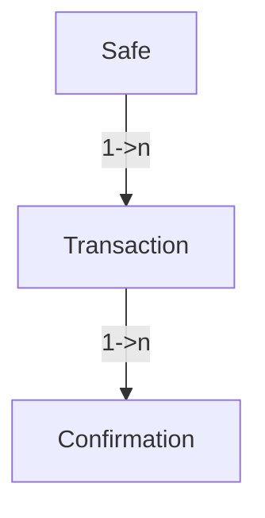

# dSafe POC 

## POC Demo is deployed at https://charming-pony-72144d.netlify.app

React dApp is connected to a hosted ComposeDB node that is indexing this dApp models. 

## Frontend only

In order to run frontend it should connect to remote ComposeDB node. To do so:

- `cd frontend`

- `npm install` all the packages

- `npm run start`

To interact with the POC dApp:

- select a `görli testnet` on your metamask

- press `sign in with ethereum`

Sign transaction as if you were a Safe owner. The signature is then being stored in the ComposeDB and synced with all the other ComposeDB nodes with the same indexing models.


## Running a ComposeDB node + frontend dapp

- Install Ceramic and ComposeDB and start a ComposeDB node
Follow https://composedb.js.org/docs/0.3.x/installation steps to do that, make sure to obtain DID private key

- Start ceramic daemon by running
`ceramic daemon`

- All models and composites are already generated and present in this repository so there is no need to redo that process. We only need to deploy merged `models.json` to our local node. (don't forget to replace DID private key with your own)

```
composedb composite:deploy ../composites/merged.json  --ceramic-url=http://localhost:7007 --did-private-key=$DID_PRIVATE_KEY 
```

- Now our local Ceramic node is tracking and indexing data for those models, and whenever data is inserted / updated our local node will sync with remote nodes and update the data locally.

- Last step is to go to `frontend` folder, install packages and run `export REACT_APP_COMPOSEDB_NODE=http://localhost:7007 && npm run start`

## How it actually works

We have 3 ComposeDB models:
- Safe - This model is required to store SAFE information and data. It is created during the creation of the Safe itself, and contains owner information, safe address information, active transactions, etc.
- Transaction - This model is a full description of the transaction. Basically a representation of the safes proposal.
- Confirmation - An approval(EIP-712 signature) of a specific transaction, waiting for the execution in the Safe.



Models are defined in `database/models`. In that folder you will see additional files that represent relationships and that allow us to search from top to bottom, and from bottom to top.

This means that we can query Safe -> get safe transactions -> get confirmations for those transactions, or go the other way around.
Confirmation -> get transaction of that confirmation -> get safe for that transaction.

## Connecting to node with grahpql server

You can connect to local node with graphql by running command from root folder.
```
composedb graphql:server --ceramic-url=http://localhost:7007 --graphiql ./database/composites/runtime-composite.json --did-private-key=$DID_PRIVATE_KEY
```
If you omit --did-private-key you can only view data, and if you provide it you can write and update data that you own.
replace `http://localhost:7007` with `https://composedb.tk` to connect to remote node

Example query that you can run to get last 20 safes with their transactions and confirmations.
```
    query {
      safeIndex(last: 20) {
        edges {
          node {
            id
            safe
            owners
            transactions(last: 5) {
              edges {
                node {
                  id
                  to
                  value
                  data
                  safe {
                    safe
                  }
                  confirmations(last: 20) {
                    edges {
                      node {
                        id
                        owner
                        signatureType
                        signature
                      }
                    }
                  }
                }
              }
            }
          }
        }
      }
    }
```