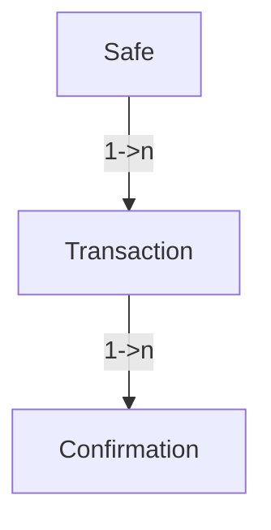

# dSafe POC 
## Deployed Demo https://charming-pony-72144d.netlify.app

React dapp is connected a hosted ComposeDB node that is indexing models used by this dapp. 

## Frontend only

If you decide to run frontend. It will connect to remote ComposeDB node and interact with it.

Go to `frontend` folder, install npm packages and run `npm run start`.

Click on any transaction (orange box) and it will prompt you to sign it as you would in a Safe Dapp if you were the safe owner. It then stores that signature in ComposeDB. ComposeDB then synces that signature with all running ComposeDB nodes that are indexing models used by this dapp.


## Running a ComposeDB node + frontend dapp

- Install Ceramic and ComposeDB and start a ComposeDB node
Follow https://composedb.js.org/docs/0.3.x/installation steps to do that, make sure to obtain DID private key

- Start ceramic daemon by running
`ceramic daemon`

- All models and composites are already generated and present in this repository so there is no need to redo that process. We only need to deploy merged `models.json` to our local node. (don't forget to replace DID private key with your own)

```
composedb composite:deploy ../composites/merged.json  --ceramic-url=http://localhost:7007 --did-private-key=$DID_PRIVATE_KEY 
```

- Now our local Ceramic node is tracking and indexing data for those models, and whenever data is inserted / updated our local node will sync with remote nodes and update the data locally.

- Last step is to go to `frontend` folder, install packages and run `export REACT_APP_COMPOSEDB_NODE=http://localhost:7007 && npm run start`

## How it actually works

We have 3 ComposeDB models:
- Safe - This model is required to store SAFE information and data. It is created during the creation of the Safe itself, and contains owner information, safe address information, active transactions, etc.
- Transaction - This model is a full description of the transaction. Basically a representation of the safes proposal.
- Confirmation - An approval(EIP-712 signature) of a specific transaction, waiting for the execution in the Safe.



Models are defined in `database/models`. In that folder you will see additional files that represent relationships and that allow us to search from top to bottom, and from bottom to top.

This means that we can query Safe -> get safe transactions -> get confirmations for those transactions, or go the other way around.
Confirmation -> get transaction of that confirmation -> get safe for that transaction.
